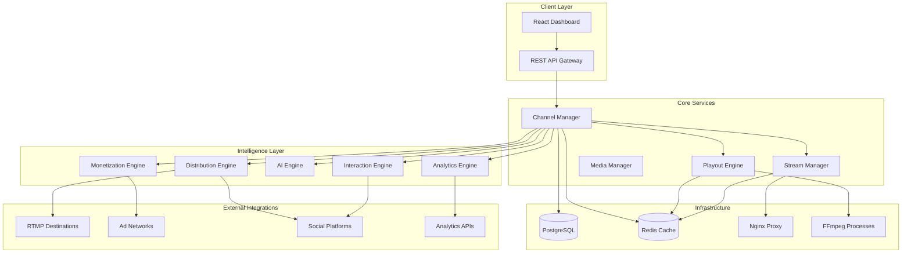

# Design Document: Channel Management System

## Overview

The Channel Management System serves as the core orchestration layer for the Cloud Playout SaaS platform, managing the complete lifecycle of 24×7 streaming channels. The system integrates multiple engines (Playout, Analytics, Monetization, AI, Distribution, and Interaction) to provide a comprehensive broadcasting and monetization ecosystem.

The architecture follows a microservices pattern with event-driven communication, ensuring scalability, reliability, and maintainability. Each channel operates as an independent streaming entity with its own FFmpeg process, configuration, and monitoring pipeline.

## Architecture



## Components and Interfaces

### Channel Manager (Core Orchestrator)

**Responsibilities:**
- Channel lifecycle management (create, start, stop, delete)
- Configuration validation and persistence
- Subscription plan enforcement
- Cross-service coordination

**Key Interfaces:**
```typescript
interface ChannelManager {
  createChannel(config: ChannelConfig): Promise<Channel>
  startChannel(channelId: string): Promise<void>
  stopChannel(channelId: string): Promise<void>
  updateChannel(channelId: string, updates: Partial<ChannelConfig>): Promise<Channel>
  getChannelStatus(channelId: string): Promise<ChannelStatus>
  enforceSubscriptionLimits(clientId: string, operation: string): Promise<boolean>
}

interface ChannelConfig {
  name: string
  resolution: Resolution
  fallbackVideo: string
  hlsEnabled: boolean
  rtmpDestinations: RTMPDestination[]
  monetizationSettings: MonetizationConfig
  analyticsEnabled: boolean
  interactionFeatures: InteractionConfig[]
}
```

### Playout Engine (Streaming Core)

**Responsibilities:**
- FFmpeg process management
- Continuous streaming orchestration
- Automatic failure recovery
- Heartbeat monitoring

**Key Interfaces:**
```typescript
interface PlayoutEngine {
  initializeStream(channelId: string, config: StreamConfig): Promise<FFmpegProcess>
  restartStream(channelId: string): Promise<void>
  terminateStream(channelId: string): Promise<void>
  getStreamHealth(channelId: string): Promise<StreamHealth>
  handleStreamFailure(channelId: string, error: StreamError): Promise<void>
}

interface StreamHealth {
  status: 'LIVE' | 'STARTING' | 'ERROR' | 'STOPPED'
  uptime: number
  lastSegmentTime: Date
  restartCount: number
  currentBitrate: number
}
```

### Stream Manager (Output Coordination)

**Responsibilities:**
- HLS segment generation and serving
- RTMP output management
- Multi-destination streaming
- Output format adaptation

**Key Interfaces:**
```typescript
interface StreamManager {
  setupHLSOutput(channelId: string): Promise<HLSEndpoint>
  setupRTMPOutput(channelId: string, destinations: RTMPDestination[]): Promise<void>
  validateRTMPConnection(destination: RTMPDestination): Promise<boolean>
  getOutputMetrics(channelId: string): Promise<OutputMetrics>
}

interface RTMPDestination {
  id: string
  serverUrl: string
  streamKey: string
  platform: 'youtube' | 'facebook' | 'twitch' | 'custom'
  enabled: boolean
}
```

### Analytics Engine (Intelligence Core)

**Responsibilities:**
- Real-time viewer tracking
- Performance metrics collection
- Report generation
- Third-party analytics integration

**Key Interfaces:**
```typescript
interface AnalyticsEngine {
  trackViewerEvent(channelId: string, event: ViewerEvent): Promise<void>
  getRealtimeMetrics(channelId: string): Promise<RealtimeMetrics>
  generateReport(channelId: string, period: TimePeriod): Promise<AnalyticsReport>
  integrateThirdParty(provider: AnalyticsProvider, config: IntegrationConfig): Promise<void>
}

interface RealtimeMetrics {
  currentViewers: number
  peakViewers: number
  averageWatchTime: number
  geographicDistribution: GeographicData[]
  deviceBreakdown: DeviceData[]
}
```

### Monetization Engine (Revenue Core)

**Responsibilities:**
- Ad insertion orchestration
- Revenue tracking
- Subscription enforcement
- Payment processing integration

**Key Interfaces:**
```typescript
interface MonetizationEngine {
  scheduleAdBreak(channelId: string, adBreak: AdBreak): Promise<void>
  integrateAdNetwork(network: AdNetwork, credentials: AdNetworkCredentials): Promise<void>
  trackRevenue(channelId: string, source: RevenueSource, amount: number): Promise<void>
  enforceSubscriptionAccess(channelId: string, viewerId: string): Promise<boolean>
}

interface AdBreak {
  type: 'pre-roll' | 'mid-roll' | 'post-roll'
  duration: number
  targetingCriteria: TargetingCriteria
  adContent: AdContent[]
}
```

### AI Engine (Optimization Core)

**Responsibilities:**
- Content scheduling optimization
- Performance prediction
- Automatic content categorization
- Viewer behavior analysis

**Key Interfaces:**
```typescript
interface AIEngine {
  optimizeSchedule(channelId: string, content: MediaItem[]): Promise<OptimizedSchedule>
  predictViewerChurn(channelId: string): Promise<ChurnPrediction>
  categorizeContent(mediaItem: MediaItem): Promise<ContentCategories>
  generateRecommendations(channelId: string): Promise<Recommendation[]>
}

interface OptimizedSchedule {
  timeSlots: TimeSlot[]
  expectedViewership: number
  revenueProjection: number
  confidenceScore: number
}
```

### Distribution Engine (Multi-Platform Core)

**Responsibilities:**
- Multi-platform streaming coordination
- Platform-specific adaptations
- Authentication management
- Unified analytics aggregation

**Key Interfaces:**
```typescript
interface DistributionEngine {
  addPlatform(channelId: string, platform: StreamingPlatform): Promise<void>
  removePlatform(channelId: string, platformId: string): Promise<void>
  adaptStreamForPlatform(channelId: string, platform: StreamingPlatform): Promise<StreamConfig>
  getUnifiedAnalytics(channelId: string): Promise<UnifiedAnalytics>
}

interface StreamingPlatform {
  id: string
  name: 'youtube' | 'facebook' | 'twitch' | 'custom'
  authCredentials: PlatformCredentials
  streamRequirements: StreamRequirements
  enabled: boolean
}
```

### Interaction Engine (Engagement Core)

**Responsibilities:**
- Live chat management
- Interactive feature orchestration
- Social media integration
- Gamification systems

**Key Interfaces:**
```typescript
interface InteractionEngine {
  enableLiveChat(channelId: string, config: ChatConfig): Promise<void>
  createPoll(channelId: string, poll: Poll): Promise<void>
  integrateSocketFeed(channelId: string, platforms: SocialPlatform[]): Promise<void>
  trackEngagement(channelId: string, event: EngagementEvent): Promise<void>
}

interface Poll {
  id: string
  question: string
  options: string[]
  duration: number
  displayOverlay: boolean
}
```

## Data Models

### Core Channel Model
```typescript
interface Channel {
  id: string
  clientId: string
  name: string
  status: ChannelStatus
  config: ChannelConfig
  createdAt: Date
  updatedAt: Date
  
  // Streaming Configuration
  resolution: Resolution
  bitrate: number
  fallbackVideo: string
  
  // Output Configuration
  hlsEndpoint: string
  rtmpDestinations: RTMPDestination[]
  
  // Feature Flags
  analyticsEnabled: boolean
  monetizationEnabled: boolean
  aiOptimizationEnabled: boolean
  multiPlatformEnabled: boolean
  interactionEnabled: boolean
  
  // Metrics
  totalUptime: number
  restartCount: number
  lastStartTime: Date
  lastStopTime: Date
}
```

### Stream Process Model
```typescript
interface StreamProcess {
  id: string
  channelId: string
  ffmpegPid: number
  status: ProcessStatus
  startTime: Date
  lastHeartbeat: Date
  
  // Configuration
  inputSource: string
  outputTargets: OutputTarget[]
  
  // Health Metrics
  cpuUsage: number
  memoryUsage: number
  networkBandwidth: number
  errorCount: number
  
  // Recovery Configuration
  maxRestarts: number
  restartDelay: number
  healthCheckInterval: number
}
```

### Analytics Data Model
```typescript
interface ViewerSession {
  id: string
  channelId: string
  viewerId: string
  startTime: Date
  endTime?: Date
  
  // Viewer Information
  ipAddress: string
  userAgent: string
  geolocation: GeolocationData
  device: DeviceInfo
  
  // Engagement Metrics
  watchTime: number
  interactionCount: number
  adViewCount: number
  chatMessageCount: number
}

interface ChannelMetrics {
  channelId: string
  timestamp: Date
  
  // Viewership
  concurrentViewers: number
  totalViews: number
  uniqueViewers: number
  averageWatchTime: number
  
  // Engagement
  chatMessages: number
  pollParticipation: number
  socialShares: number
  
  // Technical
  streamQuality: number
  bufferingEvents: number
  errorRate: number
  
  // Revenue
  adImpressions: number
  adRevenue: number
  subscriptionRevenue: number
}
```

## Error Handling

### Failure Categories and Recovery Strategies

**1. FFmpeg Process Failures**
- **Detection**: Heartbeat timeout (5 seconds)
- **Recovery**: Automatic restart with exponential backoff
- **Fallback**: Switch to fallback video stream
- **Escalation**: Alert after 3 consecutive failures

**2. RTMP Connection Failures**
- **Detection**: Connection timeout or stream rejection
- **Recovery**: Retry connection with different parameters
- **Fallback**: Continue HLS streaming, disable failed RTMP
- **Escalation**: Notify client of platform-specific issues

**3. Database Connection Issues**
- **Detection**: Connection pool exhaustion or query timeouts
- **Recovery**: Connection pool refresh and query retry
- **Fallback**: Use Redis cache for critical operations
- **Escalation**: Read-only mode if write operations fail

**4. External Service Failures**
- **Detection**: API timeout or error responses
- **Recovery**: Circuit breaker pattern with retry logic
- **Fallback**: Disable affected features temporarily
- **Escalation**: Graceful degradation with user notification

### Error Monitoring and Alerting

```typescript
interface ErrorHandler {
  handleStreamFailure(error: StreamError): Promise<RecoveryAction>
  handleServiceFailure(service: string, error: ServiceError): Promise<void>
  escalateToSupport(channelId: string, error: CriticalError): Promise<void>
  logError(error: Error, context: ErrorContext): Promise<void>
}

interface RecoveryAction {
  type: 'restart' | 'fallback' | 'escalate' | 'ignore'
  delay: number
  maxAttempts: number
  fallbackStrategy?: string
}
```

## Testing Strategy

The testing strategy employs a dual approach combining unit tests for specific scenarios and property-based tests for comprehensive validation across all possible inputs.

### Unit Testing Focus Areas
- **Configuration Validation**: Test specific channel configurations and edge cases
- **Error Handling**: Test specific failure scenarios and recovery mechanisms
- **Integration Points**: Test interactions between services and external APIs
- **Business Logic**: Test subscription enforcement and plan limit validation

### Property-Based Testing Framework
- **Library**: fast-check for TypeScript/Node.js implementation
- **Test Configuration**: Minimum 100 iterations per property test
- **Coverage**: Universal properties that must hold across all valid inputs

### Test Environment Setup
- **Isolated FFmpeg Processes**: Each test uses separate FFmpeg instances
- **Mock External Services**: Ad networks, social platforms, and analytics APIs
- **Database Transactions**: Each test runs in isolated database transaction
- **Redis Cleanup**: Automatic cleanup of cache entries between tests

## Correctness Properties

*A property is a characteristic or behavior that should hold true across all valid executions of a system—essentially, a formal statement about what the system should do. Properties serve as the bridge between human-readable specifications and machine-verifiable correctness guarantees.*

### Property 1: Channel Creation Validation and Persistence
*For any* valid channel configuration and client account, creating a channel should result in a unique channel with properly validated configuration, unique HLS URL, and immediate database persistence with all settings intact.
**Validates: Requirements 1.1, 1.2, 1.3, 1.5, 1.6**

### Property 2: RTMP Configuration Security and Validation
*For any* RTMP destination configuration, the system should validate URL format, encrypt stream keys before storage, test connectivity, and allow independent enable/disable control while enforcing subscription limits.
**Validates: Requirements 1.4, 8.1, 8.2, 8.3, 8.4, 8.5, 8.6**

### Property 3: Channel Lifecycle State Transitions
*For any* channel in any valid state, performing lifecycle operations (start/stop/restart) should result in correct status transitions, proper FFmpeg process management, and consistent database state updates.
**Validates: Requirements 2.1, 2.2, 2.3, 3.3**

### Property 4: Automatic Recovery and Continuity
*For any* channel experiencing FFmpeg crashes or RTMP connection failures, the system should automatically recover, maintain streaming continuity where possible, and fall back to appropriate alternatives without manual intervention.
**Validates: Requirements 2.4, 2.5, 4.5**

### Property 5: Heartbeat Monitoring and Health Tracking
*For any* live channel, the system should send heartbeats at 5-second intervals, detect missing heartbeats, update error status appropriately, and maintain accurate metrics for uptime, segments, and restart counts.
**Validates: Requirements 3.1, 3.2, 3.4, 3.5**

### Property 6: Dual Stream Output Consistency
*For any* channel with both HLS and RTMP outputs enabled, both streams should maintain the same bitrate, start/stop together, handle restarts with minimal interruption, and provide continuous output without gaps.
**Validates: Requirements 4.1, 4.2, 4.3, 4.4, 4.6, 4.7**

### Property 7: Subscription Plan Enforcement
*For any* client operation that involves resource limits (channels, resolution, concurrent streams), the system should enforce subscription plan limits, prevent operations that exceed limits, provide upgrade messaging, and allow admin overrides.
**Validates: Requirements 5.1, 5.2, 5.3, 5.4, 5.5, 15.3**

### Property 8: Database Consistency and Recovery
*For any* channel operation, all data changes should be persisted with ACID compliance, maintain audit trails, survive system restarts, detect corruption, and use connection pooling efficiently.
**Validates: Requirements 6.1, 6.2, 6.3, 6.4, 6.5**

### Property 9: Real-time Interface Updates
*For any* channel status change or metric update, the preview player and channel interface should reflect changes in real-time, provide accurate status indicators, display current metrics, and offer appropriate control options.
**Validates: Requirements 7.1, 7.2, 7.3, 7.4, 7.5**

### Property 10: Comprehensive Analytics Tracking
*For any* viewer interaction or content playback event, the analytics engine should track all relevant metrics, update real-time data, generate accurate reports, provide API access, and identify viewing patterns correctly.
**Validates: Requirements 10.1, 10.2, 10.3, 10.4, 10.5, 10.6**

### Property 11: Monetization Integration and Revenue Tracking
*For any* monetization event (ad insertion, subscription check, PPV access), the system should handle ad placement seamlessly, enforce access controls correctly, integrate with external networks, and track revenue attribution accurately.
**Validates: Requirements 11.1, 11.2, 11.3, 11.4, 11.5, 11.6**

### Property 12: AI-Powered Content Optimization
*For any* content analysis or optimization request, the AI engine should provide data-driven recommendations, automatically process content metadata, predict viewer behavior accurately, and optimize ad placement based on content analysis.
**Validates: Requirements 12.1, 12.2, 12.3, 12.4, 12.5, 12.6**

### Property 13: Multi-Platform Distribution Coordination
*For any* channel configured for multi-platform distribution, the system should stream simultaneously to all enabled platforms, adapt parameters per platform requirements, handle platform-specific authentication, maintain streaming when individual platforms fail, and provide unified analytics.
**Validates: Requirements 13.1, 13.2, 13.3, 13.4, 13.5, 13.6**

### Property 14: Interactive Feature Integration
*For any* interactive feature (chat, polls, social feeds, gamification), the system should integrate seamlessly with streaming, provide proper moderation controls, display overlays correctly, and track engagement metrics accurately.
**Validates: Requirements 14.1, 14.2, 14.3, 14.4, 14.5, 14.6**

### Property 15: Concurrent Multi-Channel Operations
*For any* set of channels within subscription limits, the system should support concurrent operations without conflicts, enforce limits properly, prioritize based on client tiers during resource constraints, and provide efficient bulk operations.
**Validates: Requirements 15.1, 15.2, 15.4, 15.5**