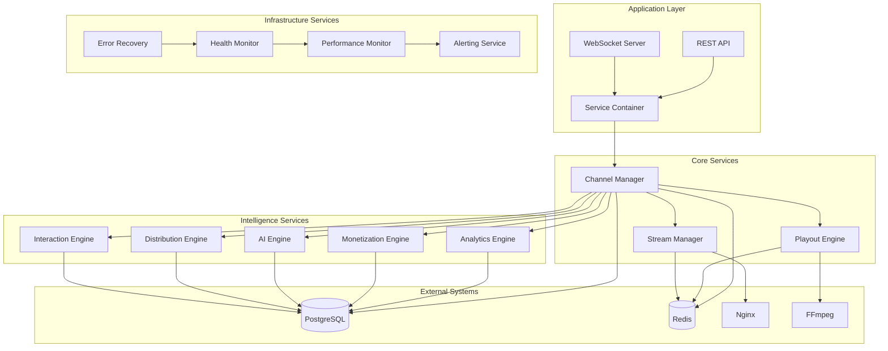

# Cloud Playout System Integration Guide

## Overview

This document provides a comprehensive guide to the integrated Cloud Playout system, covering all components, their interactions, deployment procedures, and monitoring capabilities.

## System Architecture

### Core Components

The Cloud Playout system consists of several integrated layers:

1. **Application Layer**
   - Express.js REST API server
   - WebSocket server for real-time updates
   - Service container with dependency injection

2. **Service Layer**
   - Channel Manager (core orchestration)
   - Playout Engine (FFmpeg management)
   - Stream Manager (HLS/RTMP output)
   - Analytics Engine (viewer tracking)
   - Monetization Engine (ad insertion)
   - AI Engine (content optimization)
   - Distribution Engine (multi-platform)
   - Interaction Engine (chat/polls)

3. **Infrastructure Layer**
   - PostgreSQL database
   - Redis cache
   - Nginx reverse proxy
   - Docker containers

4. **Monitoring Layer**
   - System Health Monitor
   - Performance Monitor
   - Alerting Service
   - Error Recovery Service

### Service Dependencies



## Deployment Architecture

### Development Environment

```yaml
# docker-compose.yml
services:
  - postgres (PostgreSQL database)
  - redis (Redis cache)
  - nginx (HLS serving)
  - app (Node.js application)
```

### Production Environment

```yaml
# docker-compose.prod.yml
services:
  - postgres (PostgreSQL with persistence)
  - redis (Redis with persistence and memory limits)
  - nginx (Load balancer + HLS serving)
  - app (Node.js with resource limits)
  - prometheus (Monitoring - optional)
  - grafana (Dashboards - optional)
```

## Integration Points

### 1. Service Container Integration

The `ServiceContainer` class manages all service dependencies and ensures proper initialization order:

```typescript
// Initialization order:
1. Infrastructure services (AuditLogger, CircuitBreaker, etc.)
2. Monitoring services (HealthMonitor, PerformanceMonitor, AlertingService)
3. Core engines (PlayoutEngine, StreamManager, etc.)
4. Business engines (Analytics, Monetization, AI, etc.)
5. Management services (ChannelManager, ConcurrentOperationsManager)
6. Dependency wiring between services
```

### 2. Database Integration

All services use a shared PostgreSQL database with the following integration patterns:

- **Connection Pooling**: Managed by Knex.js
- **Migrations**: Versioned schema changes
- **Transactions**: ACID compliance for critical operations
- **Health Checks**: Automatic connection monitoring

### 3. Cache Integration

Redis is used for:

- Session management
- Real-time metrics caching
- Stream status tracking
- Performance data buffering

### 4. Real-time Integration

WebSocket connections provide real-time updates for:

- Channel status changes
- Viewer analytics
- System health alerts
- Performance metrics

### 5. Monitoring Integration

Comprehensive monitoring through multiple layers:

- **Health Monitoring**: Service availability and response times
- **Performance Monitoring**: Request metrics and system resources
- **Alerting**: Automated notifications for issues
- **Error Recovery**: Automatic failure detection and recovery

## API Integration

### Core Endpoints

```
GET  /health                           # Basic health check
GET  /api/system/health               # Comprehensive system health
GET  /api/system/performance          # Performance metrics
GET  /api/system/services             # Service container status
GET  /api/system/alerts               # Active alerts
POST /api/system/alerts/test          # Create test alert
```

### Channel Management

```
POST /api/channels                    # Create channel
GET  /api/channels/:id               # Get channel status
POST /api/channels/:id/start         # Start channel
POST /api/channels/:id/stop          # Stop channel
```

### Analytics Integration

```
POST /api/analytics/events           # Track viewer events
GET  /api/analytics/channels/:id/realtime  # Real-time metrics
```

### Monetization Integration

```
POST /api/monetization/ad-breaks     # Schedule ad breaks
POST /api/monetization/events        # Track revenue events
```

## Testing Strategy

### 1. Unit Tests

- Individual service functionality
- Business logic validation
- Error handling scenarios

```bash
npm run test:unit
```

### 2. Integration Tests

- Service-to-service communication
- Database operations
- Cache operations
- API endpoint testing

```bash
npm run test:integration
```

### 3. End-to-End Tests

- Complete workflow testing
- Multi-service coordination
- Real-time feature validation
- Stress testing scenarios

```bash
npm run test:e2e
```

### 4. Comprehensive Test Suite

```bash
npm run test:all
```

## Deployment Procedures

### 1. Development Deployment

```bash
# Start development environment
docker-compose up -d

# Run migrations
npm run migrate:latest

# Start application
npm run dev
```

### 2. Production Deployment

```bash
# Deploy to production
./scripts/deploy.sh production

# Verify deployment
./scripts/health-check.sh
```

### 3. Health Verification

The deployment script automatically verifies:

- Container health status
- Database connectivity
- Redis connectivity
- API endpoint availability
- System health metrics

## Monitoring and Alerting

### 1. System Health Monitoring

Continuous monitoring of:

- Service availability
- Database connections
- Redis connectivity
- System resources (CPU, memory)
- Stream processes

### 2. Performance Monitoring

Real-time tracking of:

- Request response times
- Error rates
- System resource usage
- Streaming metrics
- Concurrent operations

### 3. Alerting System

Automated alerts for:

- System health degradation
- Performance threshold breaches
- Service failures
- Resource exhaustion
- Stream errors

### 4. Alert Channels

Configurable notification channels:

- Console output (development)
- Webhook notifications
- Email alerts
- Slack integration
- SMS notifications

## Error Handling and Recovery

### 1. Circuit Breaker Pattern

Automatic failure detection and isolation:

- Service-level circuit breakers
- Configurable failure thresholds
- Automatic recovery attempts
- Graceful degradation

### 2. Error Recovery Service

Comprehensive error recovery:

- Automatic service restarts
- Fallback mechanisms
- Manual recovery triggers
- Error escalation

### 3. Graceful Degradation

System continues operating with reduced functionality:

- Core services prioritized
- Non-essential features disabled
- User notifications for limitations

## Performance Optimization

### 1. Database Optimization

- Connection pooling
- Query optimization
- Index management
- Transaction batching

### 2. Cache Strategy

- Frequently accessed data caching
- Cache invalidation strategies
- Memory usage optimization
- Cache warming

### 3. Resource Management

- Container resource limits
- Process monitoring
- Memory leak detection
- CPU usage optimization

## Security Considerations

### 1. Network Security

- Container network isolation
- Nginx reverse proxy
- SSL/TLS termination
- Rate limiting

### 2. Data Security

- Database encryption
- Secure credential storage
- API authentication
- Input validation

### 3. Monitoring Security

- Audit logging
- Access control
- Security alerts
- Compliance tracking

## Troubleshooting Guide

### 1. Common Issues

**Service Container Not Initialized**
```bash
# Check service status
curl http://localhost:3000/api/system/services

# Restart application
docker-compose restart app
```

**Database Connection Issues**
```bash
# Check database health
docker exec cloud-playout-postgres pg_isready

# Check connection pool
curl http://localhost:3000/api/system/health
```

**Redis Connection Issues**
```bash
# Check Redis connectivity
docker exec cloud-playout-redis redis-cli ping

# Check Redis memory usage
docker exec cloud-playout-redis redis-cli info memory
```

### 2. Log Analysis

```bash
# Application logs
docker-compose logs -f app

# System logs
docker-compose logs -f

# Specific service logs
docker logs cloud-playout-app-prod
```

### 3. Performance Issues

```bash
# Check performance metrics
curl http://localhost:3000/api/system/performance

# Check active alerts
curl http://localhost:3000/api/system/alerts?active=true

# Monitor resource usage
docker stats
```

## Maintenance Procedures

### 1. Regular Maintenance

- Database maintenance (weekly)
- Log rotation (daily)
- Cache cleanup (daily)
- Performance review (weekly)

### 2. Updates and Upgrades

- Application updates
- Dependency updates
- Security patches
- Database migrations

### 3. Backup Procedures

- Database backups
- Configuration backups
- Log archival
- Disaster recovery testing

## Scaling Considerations

### 1. Horizontal Scaling

- Multiple application instances
- Load balancer configuration
- Database read replicas
- Redis clustering

### 2. Vertical Scaling

- Resource allocation tuning
- Container limits adjustment
- Database optimization
- Cache sizing

### 3. Auto-scaling

- Container orchestration
- Resource-based scaling
- Performance-based scaling
- Cost optimization

## Conclusion

The Cloud Playout system provides a comprehensive, integrated platform for 24×7 streaming channel management. The modular architecture, comprehensive monitoring, and robust error handling ensure reliable operation at scale.

For additional support or questions, refer to the API documentation and service-specific guides in the `/docs` directory.